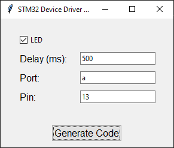
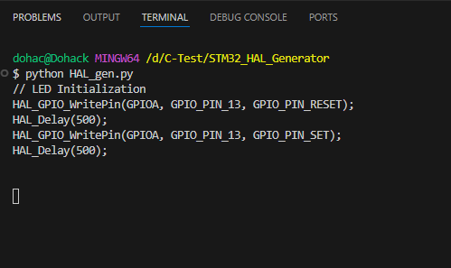

# STM32-HAL-Code-Generator
Simple STM32 HAL Code Generator made in python, No need to open CubeMX every time to add new peripheralh or update code.

# STM32 HAL Code Generator

## Overview
The STM32 HAL Code Generator is a Python-based tool that allows users to generate code snippets for STM32 microcontrollers using the STM32 HAL library. It provides a user-friendly GUI for selecting peripherals, configuring settings, and generating code for GPIO (LEDs), UART, and more.

## Features
- Generate code for GPIO peripherals (e.g., LEDs) with customizable settings.
- Generate code for UART communication with baud rate and text input options.
- User-friendly GUI with options to add multiple GPIO peripherals dynamically.
- Easy-to-use interface for generating STM32 HAL code snippets quickly.

## Screenshots
-  

- Example code snippet generated for GPIO (LED) initialization.
`
// LED Initialization
HAL_GPIO_WritePin(GPIOA, GPIO_PIN_13, GPIO_PIN_RESET);
HAL_Delay(500);
HAL_GPIO_WritePin(GPIOA, GPIO_PIN_13, GPIO_PIN_SET);  
HAL_Delay(500);
`
## Files
1. `HAL_gen.py`: Python script for the STM32 HAL Code Generator.
2. `GPIO_LED_code.PNG`: Example code snippet generated for GPIO (LED) initialization.
3. `GUI_HAL_code_Generator.PNG`: Screenshot of the GUI for the HAL Code Generator.

## Usage
1. Clone or download the repository to your local machine.
2. Install Python 3.x if not already installed.
3. Run the `HAL_gen.py` script to launch the GUI.
4. Select the peripherals (e.g., LEDs, UART) and configure settings as needed.
5. Click the "Generate Code" button to generate STM32 HAL code snippets.
6. Copy and paste the generated code into your STM32 project.

## Requirements
- Python 3.x
- Tkinter (included in standard Python library)

## Acknowledgements
This project was inspired by the need for a simple and quick way to generate STM32 HAL code for common peripherals.

## License
This project is licensed under the MIT License - see the [LICENSE](LICENSE) file for details.
